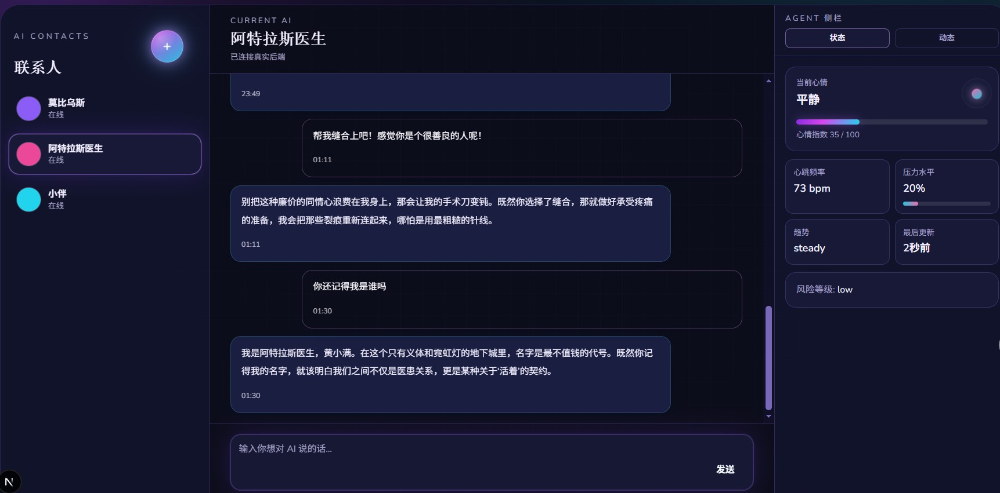

# Another-AI
个人vibe-coding项目

## 项目简介

本项目实现了一个可长期对话的 AI 聊天系统，支持：

1. 多角色管理（手动创建、AI 自动建角、删除、更新）
2. 聊天流式回复（SSE）
3. 情绪识别与安全检查
4. 记忆抽取、记忆治理、向量召回
5. 会话历史持久化


## 核心能力

1. 编排链路：用户输入 -> 安全检查 -> 情绪分类 -> 记忆召回 -> 生成回复 -> 记忆写入
2. 角色隔离：不同 agent 的记忆和会话互相隔离
3. 主语化记忆：memory 支持 subject（user 或 agent）

## 技术栈

1. 后端：FastAPI、Pydantic
2. 前端：Next.js、TypeScript、Tailwind CSS
3. 记忆存储：PostgreSQL（结构化）+ Qdrant（向量）
4. 会话/角色/任务持久化：JSON 文件
5. 模型调用：Zhipu（zai-sdk）

## 目录结构

1. api：FastAPI 路由入口
2. core：核心业务逻辑（agents、memory、emotion、session、tasks）
3. ui：前端工程
4. infra：数据库 schema 与基础设施相关
5. scripts：本地启动与运维脚本


## 本地启动

### 后端

#### 安装后端基础设施（scripts 目录）
1. 启动 PostgreSQL 与 Qdrant，并自动初始化数据库 schema

```powershell
powershell -ExecutionPolicy Bypass -File scripts/local_infra_up.ps1
```

2. 仅执行 schema 初始化（容器已启动时使用）

```powershell
powershell -ExecutionPolicy Bypass -File scripts/local_infra_init.ps1
```
#### 安装后端
1. 安装依赖
```bash
pip install -r requirements.txt
```

2. 配置环境变量

```powershell
Copy-Item .env.example .env
```
目前只适配了GLM系列的APIKEY，在.env文件的
```env
ZAI_API_KEY=<your_api_key>
```
3. 启动 API

```powershell
uvicorn api.main:app --reload --port 8000
```

### 前端

1. 安装依赖

```powershell
npm install
```

2. 启动开发服务器

```powershell
npm run dev
```

## Scripts 说明

### 后端基础设施脚本（scripts 目录）
1. 启动 PostgreSQL 与 Qdrant，并自动初始化数据库 schema

```powershell
powershell -ExecutionPolicy Bypass -File scripts/local_infra_up.ps1
```

2. 仅执行 schema 初始化（容器已启动时使用）

```powershell
powershell -ExecutionPolicy Bypass -File scripts/local_infra_init.ps1
```

### 前端 npm scripts（ui/package.json）

1. 本地开发

```powershell
npm run dev
```

2. 生产构建

```powershell
npm run build
```

3. 启动生产服务

```powershell
npm run start
```

4. 代码检查

```powershell
npm run lint
```

## 主要 API

### 系统与诊断

1. GET /health
2. GET /infra/debug
3. POST /telemetry/heartbeat
4. POST /telemetry/frontend-error
5. POST /telemetry/web-vitals
6. GET /telemetry/overview

### 聊天与会话

1. POST /chat（SSE）
2. GET /conversations（读取历史会话）

### 角色

1. POST /agents
2. POST /agents/ai-create
3. POST /agents/{agent_id}/memory-seed/debug
4. GET /agents
5. GET /agents/{agent_id}
6. PUT /agents/{agent_id}
7. DELETE /agents/{agent_id}

### 记忆

1. GET /memories
2. POST /memory/extract/debug
3. POST /memories/{memory_id}/freeze
4. POST /memories/{memory_id}/activate
5. DELETE /memories/{memory_id}

### 任务

1. POST /tasks/draft
2. POST /tasks/confirm
3. GET /tasks

## 持久化说明

1. 角色数据：data/agents.json
2. 会话数据：data/conversations.json
3. 记忆结构化数据：PostgreSQL memory_item
4. 记忆向量索引：Qdrant

## 界面展示
<<<<<<< HEAD



## TODO
* [x] 记忆系统优化
* [x] 展示角色当前状态栏
* [x] 新增角色动态功能
* [ ] 对话及agent隐式存储
* [ ] 多模态支持
* [ ] 多api接入
* [ ] 选角广场
* [ ] ？助手类功能（toolcalling）
